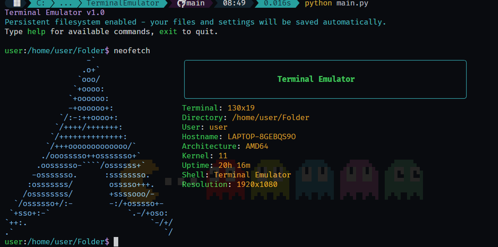

# PyTerm - A Simple Terminal Simulator

A Python-based terminal emulator with a persistent virtual filesystem, built-in Unix-like commands, and extensible architecture. This project is ideal for learning about shell environments, command parsing, and virtual filesystems.

<p align="center">
  
</p>

## Features

- **Persistent Virtual Filesystem**: Files and directories are saved between sessions using JSON.
- **Built-in Unix-like Commands**: Includes `ls`, `cd`, `cat`, `echo`, `grep`, `find`, `head`, `tail`, `sort`, `wc`, `mkdir`, `rm`, `touch`, `pwd`, `date`, `clear`, `nano`, `history`, `export`, `save`, `which`, `help`, and more.
- **System Info Command**: `neofetch` displays system and environment info in colorful ASCII art.
- **Command History**: Remembers your previous commands.
- **Environment Variables**: Supports setting and expanding environment variables.
- **Error Handling**: Custom error classes for robust and clear error reporting.
- **Extensible**: Easily add new commands by subclassing `BaseCommand`.

## Installation

1. **Clone the repository:**
   ```sh
   git clone <repo-url>
   cd TerminalEmulator
   ```
2. **(Optional) Create a virtual environment:**
   ```sh
   python -m venv venv
   source venv/bin/activate  # On Windows: venv\Scripts\activate
   ```
3. **Install dependencies:**
   - The core project uses only the Python standard library.
   - For enhanced `neofetch` info, install `psutil`:
     ```sh
     pip install psutil
     ```

## Usage

Run the terminal emulator:
```sh
python main.py
```

You will see a prompt. Type commands as you would in a Unix shell. For a list of available commands, type:
```sh
help
```

To exit, type `exit` or `quit`.

## Available Commands

| Command    | Description                        |
|------------|------------------------------------|
| ls         | List directory contents            |
| cd         | Change directory                   |
| cat        | Concatenate and display files      |
| echo       | Display a line of text            |
| grep       | Search for patterns in text        |
| find       | Find files and directories         |
| head       | Display first lines of files       |
| tail       | Display last lines of files        |
| sort       | Sort lines of text                 |
| wc         | Count lines, words, and characters |
| mkdir      | Create directories                 |
| rm         | Remove files and directories       |
| touch      | Create empty files                 |
| pwd        | Print working directory            |
| date       | Display current date and time      |
| clear      | Clear the terminal screen          |
| nano       | Simple text editor                 |
| history    | Show command history               |
| export     | Set environment variables          |
| save       | Save filesystem and environment    |
| which      | Locate a command                  |
| help       | Show help for commands             |
| neofetch   | Display system information         |

## Example

```sh
mkdir mydir
cd mydir
touch file.txt
echo "Hello, world!" > file.txt
cat file.txt
ls
neofetch
```

## Error Handling

This project uses custom error classes for robust error handling:

- `TerminalError`: Base exception for terminal errors.
- `FileSystemError`: Raised when file system operations fail.
- `InvalidArgumentError`: Raised when command arguments are invalid.
- `CommandNotFoundError`: Raised when a command is not found.

Errors are displayed in a user-friendly way in the terminal.

## Persistent Storage

- The virtual filesystem is saved in `terminal_filesystem.json`.
- Environment variables are saved in `terminal_environment.json`.
- Command history is saved in your home directory as `.terminal_history`.

## Extending the Emulator

To add a new command:
1. Create a new file in `commands/` (e.g., `my_command.py`).
2. Subclass `BaseCommand` and implement the `execute` method.
3. Import and register your command in `commands/__init__.py` and `utils/command_registry.py`.

## Testing

Basic tests for the virtual filesystem are in `utils/tests.py`. To run them:
```sh
python -c "from utils.tests import run_tests; run_tests()"
```

## Contributing

Contributions are welcome! Please open issues or pull requests for bug fixes, new features, or improvements.

## License

[MIT License](LICENSE) 